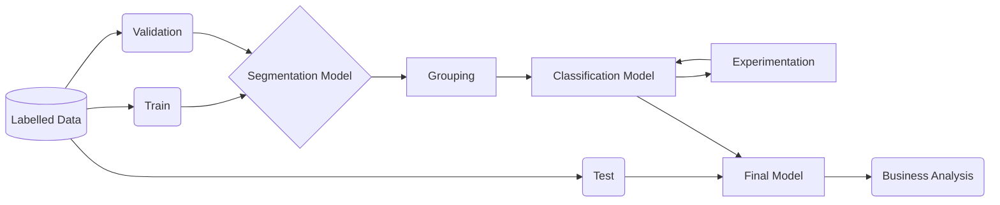

# ML Project Discussion

This document outlines the possible routes I would follow in order to train a model that detects different kinds of spores floating around several farms across Australia and elswhere. The TL;DR section below answers the task in one paragraph, as requested, and the subsequent sections go into greater detail on the approaches I would take for this challenge.

## Table of Contents

1. Task
2. [TL;DR](##2.-TL;DR)
3. [Project Scoping](##3.-Project-Scoping)
4. Data Engineering
5. ML Model Development
   1. Approach 1
   2. Approach 2
   3. Approach 3
6. Deployment
7. Monitoring and Continual Learning
8. Business Analysis

## 1. Task


> In this question, we would like you to provide a **discussion paragraph** detailing how you would go about setting up a machine learning experiment to identify a particular spore type. Assume that a labelled dataset has been provided for you, including microscope images and labels of bounding boxes. Please outline the core tasks that would need to be completed in order to develop a machine learning model for this dataset.


## 2. TL;DR

Assuming that the data gets uploaded into a data lake for which I have access rights, the next step would be to develop a pipeline locally before scalling to the cloud. This pipeline would be built using MetaFlow and it would consist of a data loader and a combination of models with an experiment tracking tool (e.g. wandb) attached to it. The best model(s) would be saved into our data lake (with a git tag attached to it, or to whichever registry we are using for our models), and it will be served as a serverless API using AWS via bentoml. The series of models would be trained using PyTorch or FastAI and they would involve a (1) semantic or instance segmentation model to identify images with spores of a given deceace. This would allow us to use the output of such a model to focus on the areas of the image that contain deceases rather than large areas with nothing on them or with regular spores. In addition, it will help us balance the limited input of images with a decease as we exclude irrelevant input. Nexr (2) we would crop high focus areas and combine them into an image that would be used to build a (3) classification model that predicts the class of the spores in the image. To pain a better picture regarding this step, imagine taking the all the squares from y=(0, 2048) and x=(0, 1024) above and combining it with different squares. The last step would be to evaluate the results against the desired metric for the project, and, if happy, deploying our solution to start making predictions.

Here's a sketch of the process highlighted above.



Here's a skeleton of the flow that would be run using MetaFlow.

```python
from metaflow import FlowSpec, Parameter, step, batch, conda, S3

class SporesClassifier(FlowSpec):

    S3_URI = Parameter(...)
    DATA_ROOT = Parameter(..., help='The local dir')
    IMAGES = Parameter(...)
    ANNOTATIONS = Parameter(...)
    PATH_TO_CONFIG = Parameter(...)
    ...

    @step
    def start(self):
        # Configure the (remote) experiment tracking location.
        import ...
        self.next(self.data_loader_from_s3)
    
    @step
    def data_loader_from_s3():
        """Get and Prep the Data"""
        self.dls = SegmentationDataLoaders.from_(...)
        self.next(self.train)

    
    @batch(gpu=1, memory=32000, image='gpu-latest', shared_memory=8000)
    @conda({"fastai": "2.7.11"})
    @step
    def train_unet(self):
        from fastai.vision.all import *
        self.train_args = dict("...": ...)
        self.learn = unet_learner(self.dls, **self.train_args)
        self.learn.fine_tune(8)
        self.next(self.grouping)

    @batch(cpu=6, memory=16000)
    @step
    def grouping(self):
        ...
        self.next(self.end)
    
    @batch(gpu=1, memory=32000, image='gpu-latest')
    @conda({"fastai": "2.7.11"})
    @step
    def train_cnn(self):
        from fastai.vision.all import *
        self.next(self.evaluate)

    @batch(cpu=4, memory=8000)
    @step
    def evaluate(self):
        ...
        bentoml.fastai.save_model(...)
        self.next(self.end)

    @step
    def end(self):
        """Analysis"""
        pass

if __name__ == '__main__':
    SporesClassifier()
```


## 3. Project Scoping

The

## 4. Data Engineering

## 5. ML Model Development

### 5.1 Approach 1

Pure classification, identifying the classes available

### 5.2 Approach 2

segmentation > grouping > classification > analysis

### 5.3 Approach 3

Augmentation

## 6. Deployment

AWS

BentoML (requires that docker terraform)

## 7. Monitoring and Continual Learning

Alibi detect

## 8. Business Analysis

Analysis of the classification output

## 9. Conclusion
