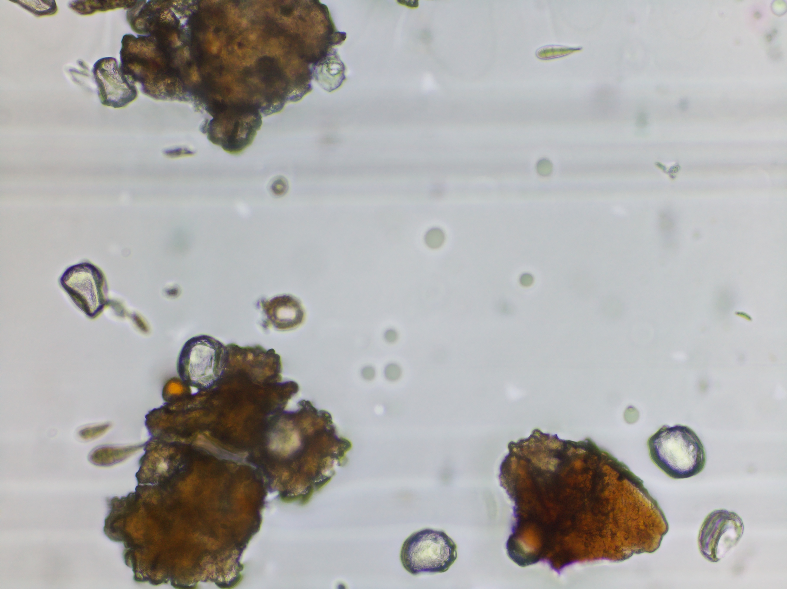
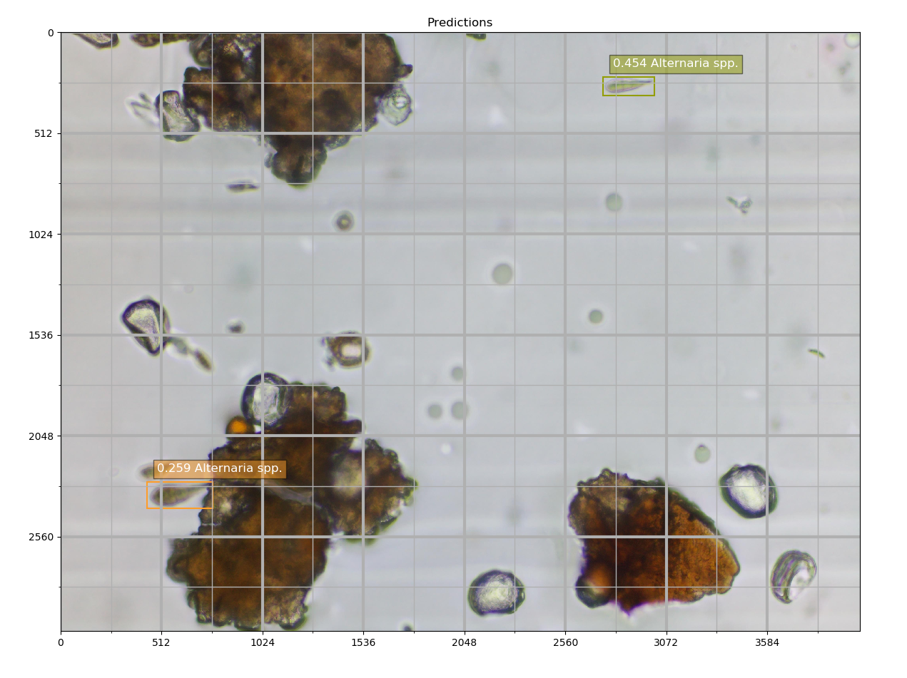
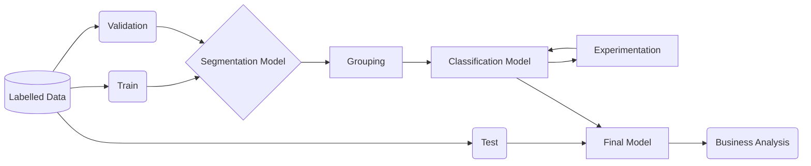

# ML Project Discussion

This document outlines the possible routes I would follow to train a model that detects different kinds of spores floating around several farms across Australia and elsewhere. The TL;DR section below answers the task in one paragraph, as requested, and the subsequent sections go into greater detail on the approaches I would take for this challenge.

## Table of Contents

1. [Task](##1.-Task)
2. [TL;DR](##2.-TL;DR)
3. [Project Scoping](##3.-Project-Scoping)
4. [Data Engineering](##4.-Data-Engineering)
5. [ML Model Development](##5.-ML-Model-Development)
   1. [Approach 1](###1.-Approach-1)
   2. [Approach 2](##2.-Approach-2)
   3. [Approach 3](###3.-Approach-3)
6. [Deployment](##6.-Deployment)
7. [Monitoring and Continual Learning](##7.-Monitoring-and-Continual-Learning)
8. [Business Analysis](##8.-Business-Analysis)

## 1. Task



> In this question, we would like you to provide a **discussion paragraph** detailing how you would go about setting up a machine learning experiment to identify a particular spore type. Assume that a labeled dataset has been provided for you, including microscope images and labels of bounding boxes. Please outline the core tasks that would need to be completed to develop a machine learning model for this dataset.




## 2. TL;DR

Let's assume the labeled data is now resting in a data lake ready-to-be-used, the next step would be to develop a pipeline locally before scaling to the cloud. This pipeline would be built using, say, MetaFlow and it would consist of a data loader and a combination of models with an experiment tracking tool (e.g. wandb) attached to the modeling step. The best models would be saved into our data lake (with git tags attached to them, or to whichever registry we are using for our models), and the candidates would be served in a pipeline as a serverless API using bentoml and AWS. The series of models would be trained using PyTorch or FastAI and they would involve a (1) semantic or instance segmentation model to identify images with spores of a given deceased. This would allow us to use the output of such a model to focus on the areas of the image that contain diseases rather than large areas with nothing or with regular spores on them. In addition, this model will help us balance the limited input of images with a decrease as we exclude irrelevant input. Next, (2) we would crop high-focus areas and combine them into an image that would be used to build a (3) classification model that predicts the class of the spores in the image. To paint a better picture regarding step 2, imagine taking all the squares from y=(0, 2048) and x=(0, 1024) in the image above and combining them with different squares. This would effectively give us a new image to train a classifier on. The last step would be to evaluate the results against the desired metric for the project and, if happy, deploy our solution to start making predictions on behalf of our farmers.


Here's a sketch of the process highlighted above.



Here's a skeleton of the flow that would be run using MetaFlow.

```python
from metaflow import FlowSpec, Parameter, step, batch, conda, S3

class SporesClassifier(FlowSpec):

    S3_URI = Parameter(...)
    DATA_ROOT = Parameter(..., help='The local dir')
    IMAGES = Parameter(...)
    ANNOTATIONS = Parameter(...)
    PATH_TO_CONFIG = Parameter(...)
    ...

    @step
    def start(self):
        # Configure the (remote) experiment tracking location.
        import ...
        self.next(self.data_loader_from_s3)
    
    @step
    def data_loader_from_s3():
        """Get and Prep the Data"""
        self.dls = SegmentationDataLoaders.from_(...)
        self.next(self.train)

    
    @batch(gpu=1, memory=32000, image='gpu-latest', shared_memory=8000)
    @conda({"fastai": "2.7.11"})
    @step
    def train_unet(self):
        from fastai.vision.all import *
        self.train_args = dict("...": ...)
        self.learn = unet_learner(self.dls, **self.train_args)
        self.learn.fine_tune(8)
        self.next(self.grouping)

    @batch(cpu=6, memory=16000)
    @step
    def grouping(self):
        ...
        self.next(self.end)
    
    @batch(gpu=1, memory=32000, image='gpu-latest')
    @conda({"fastai": "2.7.11"})
    @step
    def train_cnn(self):
        from fastai.vision.all import *
        self.next(self.evaluate)

    @batch(cpu=4, memory=8000)
    @step
    def evaluate(self):
        ...
        bentoml.fastai.save_model(...)
        self.next(self.end)

    @step
    def end(self):
        """Analysis"""
        pass

if __name__ == '__main__':
    SporesClassifier()
```


## 3. Project Scoping

It is important to lay out the foundation for our project before we begin. This foundation will include the overall goal of the project, metrics to optimize for, potential challenges, and more. Let's highlight these for our project.

- Goal: To reduce the amount of human labor required to label microscope-taken images with dreadful spores in them.

- Main Metric: Recall and, potentially, Specificity since we want to maximize the number of true predictions in the dataset and minimize the cost farmers incur when adding unnecessary pesticides.

- Potential challenges: highly imbalanced dataset.

## 4. Data Engineering

In this step, we would evaluate the shape and form of the images ingested by our models and create pipelines to have the images ready to go for training at any given moment. In addition, these pipelines would, ideally, be orchestrated in different ways, for example, to run every evening at midnight on VMs with different hardware requirements. For the orchestration layer, we would use either an open-source tool like MetaFlow, or a cloud-native one like Amazon Glue.

Why different hardware requirements? If different pieces of hardware are down for maintenance for a day or two, that means that our pipeline will process fewer images and, therefore, would need fewer resources.

Note: Orchestrators and schedulers differ in one important way, resources. While orchestrators can schedule, queue, and manage the resources a series of jobs would need, a scheduler cannot.

## 5. ML Model Development

Our model development would consist of a few parts:

1. Data Loaders: Assuming we will use PyTorch or FastAI, our data loader would be the piece of our model development pipeline that we connect to the output of our ETL or ELT pipeline from the previous method. Ideally, in this step, we will manage train/valid/test split and other transformations necessary. For example, we would take our spores' annotated images for our task and split it 60-20-20.

2. Model or Series of Models: While we would most likely try one model at a time for inference, it is normal to test approaches that chain multiple models together, as discussed in the TL;DR section. 

3. Experimentation Approach: In this stage, we want to try a combination of hyperparameters (e.g. learning rate) using a tool like Optuna, with an experiment tracking tool like Weights & Biases or MLFlow. That way we won't forget which combinations we ran and which was the best.

4. Model Store: Our models should be kept in an organized way so that we can access them easily in case we need to roll back to a previous version or select a newer and better one. Weights & Biases provides a way to save artifacts in it, and another (somewhat preferred) way of saving a model would be via bentoml.

### 5.1 Approach 1

Since we already have labelled images with a class and the coordinates for the bounding box around the spores with a decease, we would start with object detection classification model that predicts the class. This model could be a R-CNN or Regional-based Convolutional Neural Network (ok but not the best), or a YOLO (You Only Look Once) algorithm (preferred) since it splits the image into grids and it learns not only the class available but also the position of the bouding box.

### 5.2 Approach 2

The second approach we could take is the one describe in the TL;DR above. This involved a segmentation model, followed by some grouping to create new images that would then be passed through a CNN for classification. After some experimentation, we would evaluate the results and pick the best parametrized pipeline to put in production.

### 5.3 Approach 3

This step would require going back to the data engineering part to first create a new pipeline that crops regions of our images and returns a new set of images with only one class in them. Second, we would generate synthetic data of the classes with bad spores and approach training with a regular convolutional neural network.

## 6. Deployment

BentoML, which requires having docker and terraform installed, is one of the fastest ways for productionizing ML via serverless functions on multiple cloud providers (AWS in our case). I not only helps us build type-safe services for our models but it also allows us to keep them stored in one central location, regardless of which environment we install bentoml in.

## 7. Monitoring and Continual Learning

While the way in which spores get captured might not change drastically with time, the pieace of hardware we house could suck water droplets, dirt, and other kinds of spores that combined could lead our models to provide wrong predictions. To combat this, we could use tools like Alibi Detect to measure feature drift, or evidently.ai to have a more continuous view of our what our models are receiving and returning upon predicting the class of a new image.

## 8. Business Analysis

This last piece focuses on the way in which we analyze our models' predictions to maximize business value, and the way in which we show predictions output our users via our dashboard. Some questions I would work through include, are the visualizations in place the best ones to showcase the results of our model? Are there other ways to show additional information about our models, or the data in general, to our users to increase engagement? Can we create a in-house labeling tool and hold labelling parties where everyone in the company help labell some data?

## 9. Conclusion

A multi-stage model approach might be a good choice for a pipeline that predicts multiple classes and a bounding box for each image. In addition, the infrastructure around our data can depend AWS and on proprietary tools like Amazon Glue for ETL data engineering work, or open source ones like metaflow for our pipelines, bentoml for deployment, and Weights & Biases for experimentation. The model development lifecycle can rest at ease with PyTorch and the architecture of choice (i.e. yolo, r-cnn, or cnn) can depend on the model pipeline.
